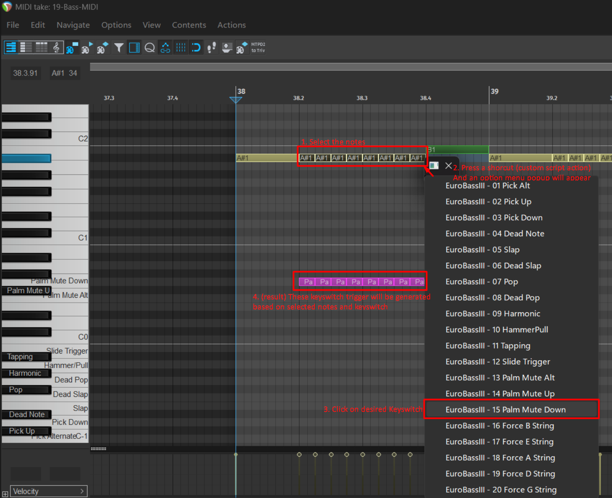

# Ed's - ArticulateTruBass ReaScript (.lua) 
REAPER Version: 7.39 (as the time the code was written, but they do update very often!)

Still work in 7.51 without any compatibility issue.

## What is this?
**REAPER (DAW)** script to simplify adding keyswitch articulation trigger easier.
It's now serve the purpose to be used for **TruBass** labeled Submission Audio's libraries.
Not intended to be used with old **Submission Audio** bass libraries, e.g **DjinnBass**, **EuroBass I-II**, **PunkBass** or any non **TruBass** libraries.

Libraries listed here are supported:
https://www.submissionaudio.com/products/trubass-bundle

Please note that articulations that are listed will work based on bass library you use, check for the **Keyswitch Map** page in its interface for available articulations.

  
  

Showcase video soon!

## Current Features:
- [x] Assignable key to open custom menu and select the list from there
- [x] Select MIDI note(s) you want to add, then select the desired keyswitch articulation
- [x] Delete overlapping articulation note(s) if existing when the action is done
- [x] Slide and Hammer/Pull Triggers behaves like how it works, shares the same algorithm of code, you still need to manually adjust the velocity for the slide speed
