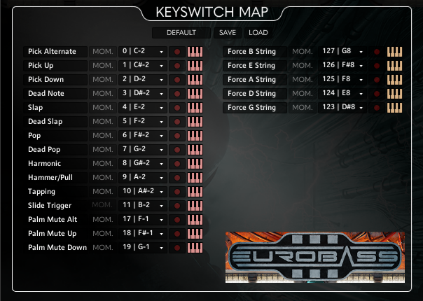

# Ed's - ArticulateTriggerNOW! ReaScript (.lua) 
REAPER Version: 7.39 (as the time the code was written, but they do update very often!)

## What is this?
REAPER (DAW) script to simplify adding keyswitch articulation trigger easier.

Currently available files: [SubMission Audio's EuroBass III](https://www.submissionaudio.com/products/eurobass3), a [Kontakt Player](https://www.native-instruments.com/en/products/komplete/samplers/kontakt-8-player/?srsltid=AfmBOoqA7mYvi1lJLUUI6ao1HPyH3_lAAcp3xvY3iHjl7vLy-RANRMrM) library and using it's default keymap, you can adjust the code based on your liking!

  
  

Showcase video soon!

## Current Features:
- [x] Key to open custom menu and select the list from there
- [x] Select MIDI note(s) you want to add, then select the desired keyswitch articulation
- [x] Delete overlapping MIDI note if existing when the action is done

## To Do:
- [ ] Auto detect .lua script files instead of manually registering it to the menu .lua  
- [ ] Easier customization, maybe a single script instead of multiple for efficiency
